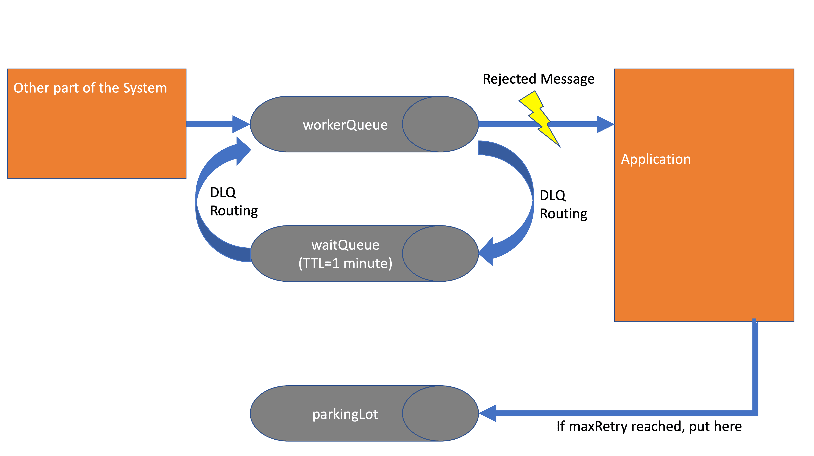

# rabbitmq-deadletter-demo-non-blocking

Sample project to handle stuck messages in RabbitMQ using non-blocking retries.

What do we see here?

WorkerQueue: The queue which contains our internal event to trigger the update to the external system. Our Application
is bound to it and consumes all messages. It has a DLQ configuration to pass rejected messages to the WaitQueue.

WaitQueue: Most of the magic lives here: It has no active listener bound, but a TTL of 1 minute and a DLQ configuration.
With this in place, it will forward all messages which it receives after 1 minute to the defined DLQ. We use this to put
our messages back into the WorkerQueue after 1 minute.

ParkingLot: When an update didn’t make it after all Retries got executed - we put it in the parkingLot so that we can
have a manual look why the messages were not able to get processed. The application could also contain a logic to
publish here directly to get rid of poison messages.
